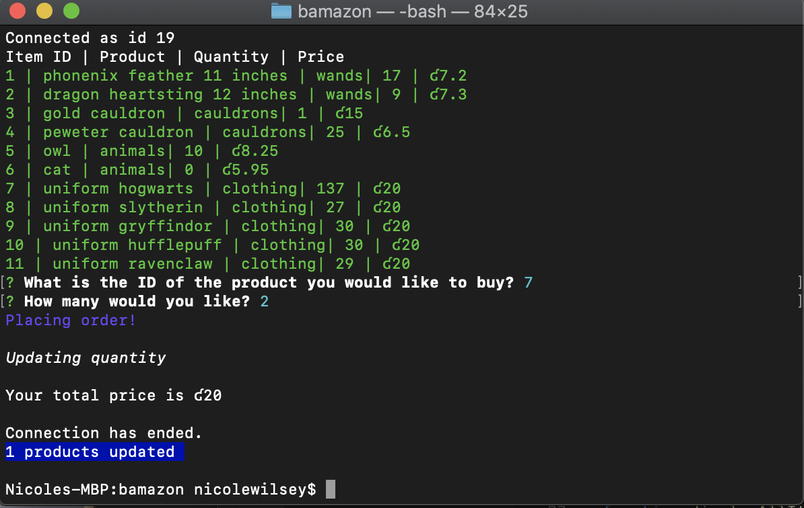
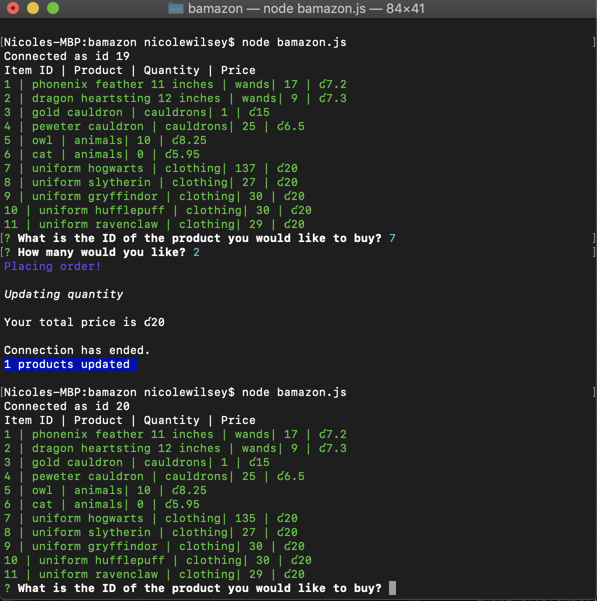
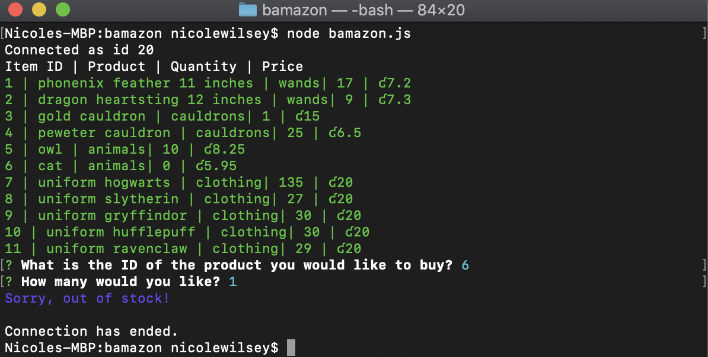

# bamazon

## Overview 
bamazon is a Command Line Interface (CLI) application showing a Harry Potter storefront using MySQL and node.js taking in parameters from the user and outputting data. bamazon can search for any of the items the user can see in the "storefront" by ID number.

## Use 
bAmazon is a virtual storefront using MySQL that can take in orders from customers and update stock from the store's inventory based on customer orders. As bamazon is a CLI application, I have provided screenshots below showing how it works. 

When initialized using node the entire store's inventory will display. The application will then ask for the ID of the product the user would like to purchase, followed by asking the quantity. If it is in stock, the application will place the order, update the quantity, and give the total price. The connection to the database will end and it logs how many products were updated. 

After the order is purchased, the store's inventory will be depleted. (Look for ID number 7 which will be deceased by two).

Finally, if the user attempts to purchase an item which is out of stock, they will get an "out of stock" notice and the connection will end. 

